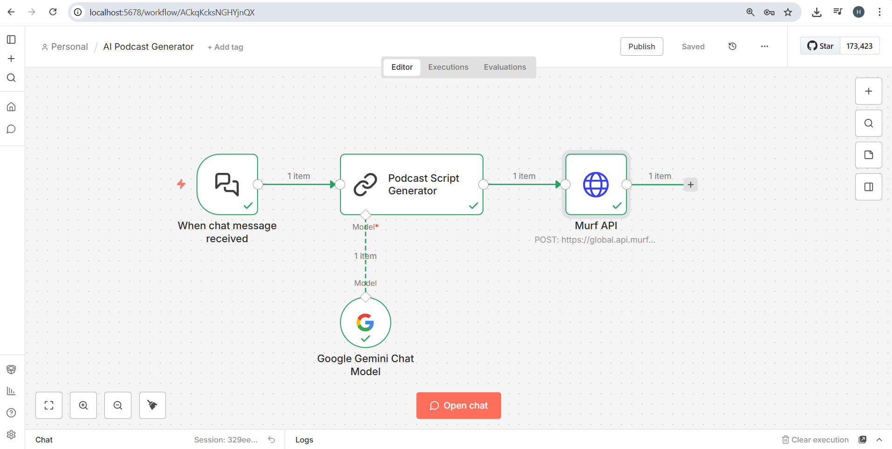

# 🎙️ AI Podcast Generator using n8n & LLMs

## 📌 Overview
This project is an AI-powered podcast generator built using n8n automation.
It converts user chat input into a complete podcast script using an LLM
and then generates realistic voice audio using a Text-to-Speech API.

## 🎥 Demo

1. User provides a podcast topic via chat
2. AI generates a structured podcast script
3. Script is converted into realistic speech
4. Final podcast audio is produced and downloaded

## 🧠 Tech Stack
- n8n (Workflow Automation)
- Google Gemini (LLM)
- Murf AI (Text-to-Speech)
- REST APIs
- JavaScript (n8n expressions)

## 🔄 Workflow Explanation
1. User sends a chat message (topic)
2. LLM generates a structured podcast script
3. Script is sent to Murf API
4. Audio podcast is generated automatically

## 🗂️ Workflow Architecture

## 🎧 Sample Podcast Output

This section contains a sample audio file generated by the AI Podcast Generator
workflow. The audio was created by converting an AI-generated podcast script
into speech using the Murf Text-to-Speech API.

📂 File location: output/sample_podcast.mp3

## ⚙️ Setup Instructions
1. Clone the repository
2. Install and run n8n
3. Import the workflow JSON
4. Add API keys as environment variables
5. Run the workflow and send a chat input

## 🚀 Use Cases
- Automated podcast creation
- Voice content generation
- AI-based media automation

## 📈 Future Enhancements
- Multiple speakers
- Language selection
- Background music integration
- Cloud deployment

## 📜 License

This project is licensed under the MIT License.

## 👨‍🎓 Author
B.Tech 3rd Year Student | AI, Data Science & Analytics Enthusiast
